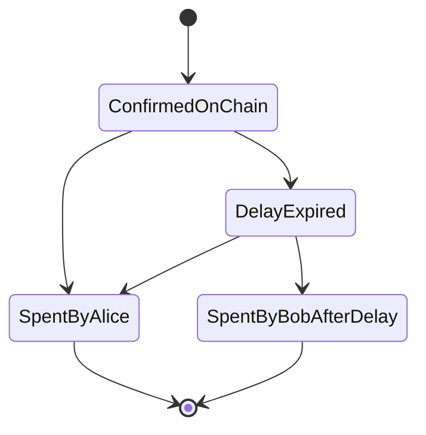

# Contract Branch Executions

The DSL makes it easy to run the transactions along the various
execution paths of a contract.

---

The challenge when developing contracts is to execute the various
branches the contracts can execute on. The branches that are executed
depend on the state of the chain and the data provided by the parties
executing the contract transactions. 

With the DSL a developer can declaratively move the state of the
system (bitcoin, transactions and user data) and then execute the
branches.

After each branch execution the developer can then run assertions on
the state of the system. See [Assertions](/reference#assertions) for
all the supported assertions.

The execution paths are best described with an simple contract that
has two branches - a simple timelock contract.

## Simple timelock contract

Let's say there is a contract where Alice can spend the transaction at
any time and Bob can only spend the transaction after 10 blocks.



The state transition of the contract above shows how even in a simple
contract, we need to be careful when exploring all execution paths. We
need to verify the following behaviours:

1. Alice can immediately spend from confirmation.
2. Alice can spend from confirmation after delay has expired.
3. Bob can not spend before delay has expired.
4. Bob can spend after delay has expired.

The pain point the Bitcoin DSL solves is the ability to run through
all the states and then run assertions at each state about the state
of the system.

## Executing the state transition diagram

The scripts below show how we can transition the system from one state
to the other and then run assertions for the transition.

### Setup

```ruby
```

### Alice spends immediately

### Alice spends after delay

### Bob can not spend immediately

### Bob can spend after a delay
